# StoryForgeAI — Architecture & Agent Process

The single architecture reference for **StoryForgeAI**: how it is put together and,
in particular, how its **agent team** is wired — which agents exist, what each one
consumes and produces, how artifacts flow between them, and where the hand-offs to
media generation, audio, and assembly happen.

- **Style:** modular monolith — a single Next.js App Router deployable, plus
  optional sidecars (WanGP MCP server, Deepy, ffmpeg, PostgreSQL).
- **Guiding principle:** every external integration sits behind a feature flag and
  a swappable interface. The app boots and runs a complete pipeline with an empty
  environment; real systems are attached by configuration, not by rewriting logic.
- **Agent parity rule:** every agent has a deterministic builder *and* an optional
  LLM path, and both must emit the **same artifact shape**. A missing, disabled, or
  misbehaving LLM degrades to the deterministic builder — it never fails a request.

---

## 1. System context

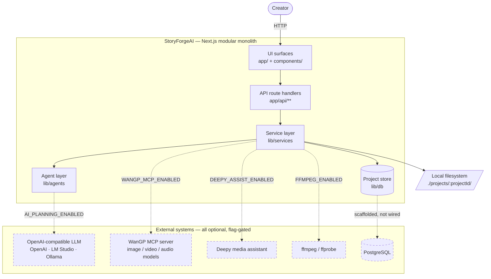

Dashed edges are **off by default**. Each is replaced by an in-process
deterministic mock so the whole product is exercisable with zero dependencies.
Structured project data lives in memory; only rendered media touches disk — see
[§7.1](#71-where-data-actually-lives).

---

## 2. Layered architecture

Business logic lives only in the service layer. Route handlers resolve params,
validate with Zod, call a service, and return JSON.

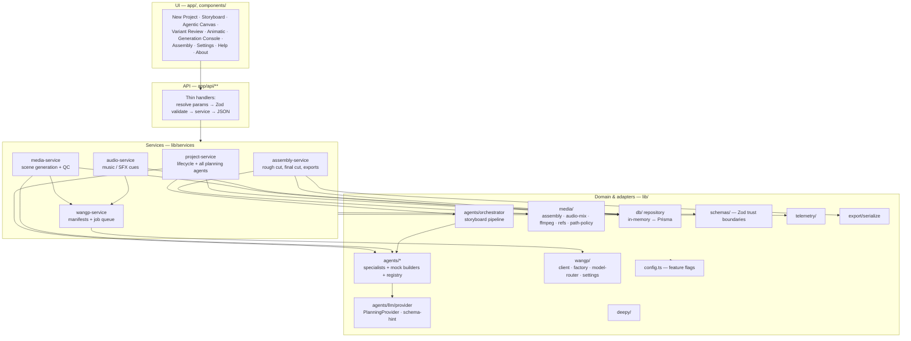

| Layer | Responsibility | Rule |
|---|---|---|
| UI components | Presentation and interaction | No data access, no business rules |
| Route handlers | HTTP boundary, validation, delegation | Thin; validate then call a service |
| Services | All business logic and orchestration | Dependency-injected, testable |
| Agents | Creative reasoning, artifact production | Deterministic builder + optional LLM |
| Adapters | External systems behind an interface | Always paired with a mock |
| Cross-cutting | Config, schemas, telemetry | Imported everywhere; no upward deps |

### 2.1 Source layout

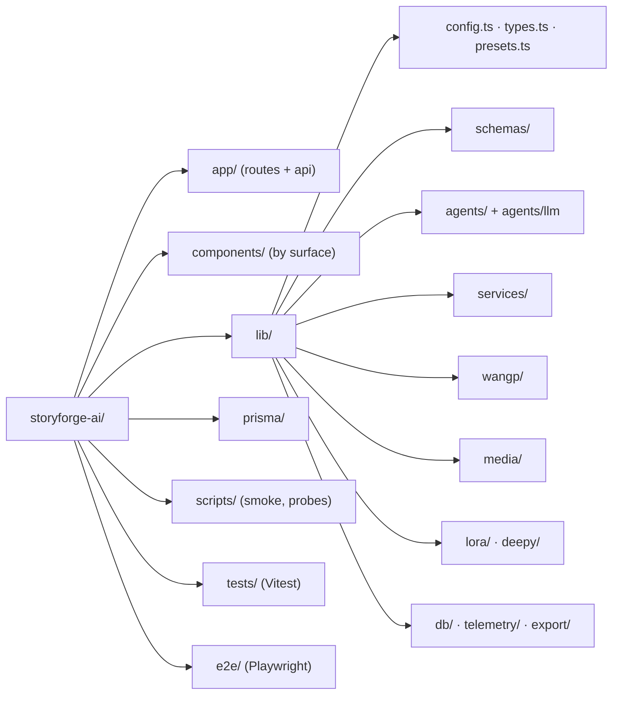

---

## 3. The agent team

Two distinct agent groups operate on a project, plus supporting agents on the
media path.

### 3.1 Roster

| # | Agent | Module | Consumes | Produces | Schema | Invoked by |
|---|---|---|---|---|---|---|
| 1 | **Variant Explorer** | `canvas-agents.ts` | `Project` | 3 creative directions, each on a different `variantType` axis | `creativeVariantSchema[]` | `POST /generate-variants` |
| 2 | **World Builder** | `canvas-agents.ts` | `Project` + variant + cast + story plan | World Bible | `worldBibleSchema` | `POST /generate-world-bible` |
| 3 | **Director** | `canvas-agents.ts` | `Project` + variant + cast + story plan + plans (+ explicitness directive) | Directorial plan | `directorialPlanSchema` | `POST /generate-directorial-plan` |
| 4 | **Cinematographer** | `canvas-agents.ts` | `Project` (incl. continuity mode) + variant + story plan + plans | Camera plan | `cinematographyPlanSchema` | `POST /generate-cinematography-plan` |
| 5 | **Art Director** | `canvas-agents.ts` | `Project` + variant + cast + story plan + plans | Art direction plan | `artDirectionPlanSchema` | `POST /generate-art-direction-plan` |
| 6 | **Intake Producer** | `intake-agent.ts` | `Project` (+ selected variant) | Creative brief | `creativeBriefSchema` | Orchestrator, step 1 |
| 7 | **Story Architect** | `story-architect-agent.ts` | `Project` + brief | Story plan, 1 beat per segment | `storyPlanSchema` | Orchestrator, step 2 |
| 8 | **Visual Bible** | `visual-bible-agent.ts` | `Project` + brief | Continuity guide | `visualBibleSchema` | Orchestrator, step 3 |
| 9 | **Storyboard Artist** | `storyboard-agent.ts` | `Project` + brief + story plan + visual bible (+ explicitness directive) | Scene drafts, incl. `charactersPresent` and `wardrobeChanges` | `sceneDraftSchema[]` | Orchestrator, step 4 |
| 10 | **Image Prompt Engineer** | `prompt-agents.ts` | `Project` + scene draft + **previous end-frame prompt** + visual bible + **this scene's cast** + plan slices + wardrobe state | Start/end frame prompts + negative | subset of `scenePromptsSchema` | Orchestrator, step 5 |
| 11 | **Video Prompt Engineer** | `prompt-agents.ts` | as above, but the cast arrives as **names only** — the start frame already carries the likeness | Motion prompt + negative + checklist | subset of `scenePromptsSchema` | Orchestrator, step 5 |
| 12 | **Audio Director** | `audio-agents.ts` | `Project` + scene refs | Audio plan, music/SFX cues | `audioPlanSchema` | `POST /generate-audio-plan` |
| 13 | **Creative Critic (QC)** | `qc-agent.ts` | `Scene` + `SceneAttempt` (+ keyframes when `OPENAI_VISION_MODEL` is set) | Pass/fail, severity, regen notes | `qcResultSchema` | `media-service`, only when `project.qcEnabled` |
| — | **Deepy assistant** | `deepy/deepy.ts` | Media path + action | Inspection/suggestion text | — | `POST /scenes/{id}/deepy` |
| — | **Animatic builder** | `mock-audio.ts` | Storyboard snapshot | Animatic plan | `animaticPlanSchema` | `POST /generate-animatic` |

`lib/agents/registry.ts` is the declarative roster surfaced in the UI; it also
carries `wangp_settings` (WanGP Producer) as a phase-3 descriptor whose behaviour
is currently implemented directly by `wangp-service` + `lib/wangp/settings.ts`
rather than as a standalone agent module.

### 3.2 Full agent interconnection map

This is the complete picture of who feeds whom. Solid edges are **artifact
dependencies enforced in code**. The canvas plans were originally advisory
(read by a creator, never threaded into a callee's payload); they are now
threaded into the storyboard pipeline, whole for the planning agents and sliced
per scene for the prompt agents.

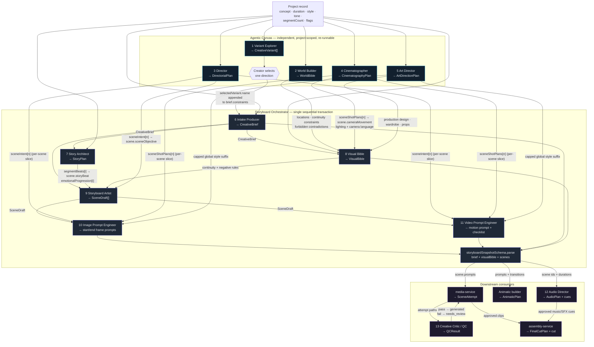

**Key structural facts this diagram encodes:**

1. **Only the storyboard pipeline threads shared state.** `AgentContext` in
   `lib/agents/types.ts` carries `project`, `selectedVariant`, `cast`, `plans`,
   `brief`, `storyPlan`, `visualBible`, `sceneDrafts` and is mutated in place as
   each agent completes. Later agents read what earlier agents wrote.
2. **Canvas agents are deliberately independent to *produce*, but their output is
   consumed.** World Builder, Director, Cinematographer, and Art Director each
   receive only `{ project }`, so they can be run in any order, any number of
   times, and never block one another. Whatever exists on the `ProjectRecord` at
   `generateStoryboard` time is then threaded into the pipeline by
   `lib/agents/creative-context.ts`.
3. **Plan context is budgeted, not dumped.** Planning agents (Visual Bible,
   Storyboard Artist) receive the plan documents whole — they run once and emit
   prose. Prompt agents receive only `sceneIntent[n]` and `sceneShotPlans[n]` for
   their own scene plus a capped global style suffix, because a render prompt
   that buries the subject and action behind pages of world-building loses
   adherence. This is what the per-scene maps in `directorialPlanSchema` and
   `cinematographyPlanSchema` exist for.
4. **Conflicts resolve by stated precedence.** Pinned character library entries
   beat the Visual Bible, which beats the Art Direction, Cinematography and World
   Bible plans. `precedenceDirective()` states this in the system prompt and the
   deterministic builders apply the same order, so the resolution does not vary
   scene to scene.
5. **The selected variant carries its substance.** `selectVariant` sets
   `selectedVariantId`; `generateStoryboard` looks the variant up and the
   orchestrator appends its name, summary, hook, story angle, visual style and
   risks to `brief.constraints`. Every later agent reads the brief, so the chosen
   direction propagates throughout.
6. **Prompt agents fan out per scene.** `attachScenePrompts` loops the drafts and
   makes *two* provider calls per scene — image then video — so a project with
   N segments issues up to `4 + 2N` LLM calls for one storyboard run.
7. **QC forms the only feedback loop.** Its verdict sets scene status, which gates
   whether the creator regenerates or approves; approval gates assembly.
8. **Plan influence is bound at storyboard-generation time, not at render time.**
   This is the most important temporal property in the system and the easiest to
   miss. `generateStoryboard` reads `record.worldBible`, `record.directorialPlan`,
   `record.cinematographyPlan` and `record.artDirectionPlan` *once*, and their
   content is baked into `scene.prompts.*`. `media-service` then reads nothing but
   those prompt strings — it never dereferences a plan. The practical consequence:

   ```
   canvas plans ──(read once, at generateStoryboard)──▶ scene.prompts.* ──▶ WanGP
   ```

   A plan generated *after* the storyboard therefore has **zero effect on rendering**
   until the storyboard is regenerated, even though the Agentic Canvas shows it as
   `ready`. Because this is a silent no-op, `components/storyboard/creative-plans-panel.tsx`
   compares the newest `*_plan.generated` / `world_bible.generated` history entry
   against the newest `storyboard.generated` entry and marks any plan that post-dates
   the storyboard as *not applied yet*, with a regenerate action. Scene ids are
   deterministic (`<projectId>-scene-NNN`), so regenerating preserves attempts,
   media and per-scene LoRA overrides when the scene count is unchanged.
9. **Not every canvas agent reaches a rendered frame.** Audio Director feeds the
   audio plan, cues and assembly only. The Animatic builder consumes stills that
   already exist. Variant Explorer influences rendering only indirectly, via the
   brief constraints of a storyboard generated after selection. Only World Builder,
   Director, Cinematographer and Art Director alter image and video prompts.
10. **Planning calls are serialized against a local provider.** `getPlanningProvider()`
    wraps every call in a process-wide promise chain when `OPENAI_BASE_URL` is set.
    A local model serves one request at a time, so overlapping calls are slower at
    best and exhaust VRAM at worst — and the canvas previously disabled only the
    button that was clicked, so four agents could be started at once. Wrapping at
    the composition boundary rather than inside the provider serializes every
    consumer by construction, including `attachScenePrompts`' `2N` fan-out and a
    second browser tab. A hosted API has no session limit and would only be slowed,
    so the chain is skipped there. A predecessor's rejection is swallowed so one
    failed agent cannot strand everything queued behind it.

    The canvas's **Run core agents** control drives the four plan agents in
    dependency order and then the storyboard, client-side and sequentially. That is
    a UX affordance rather than the safety mechanism: the server-side chain is what
    actually prevents collision.

### 3.3 Orchestrator sequence

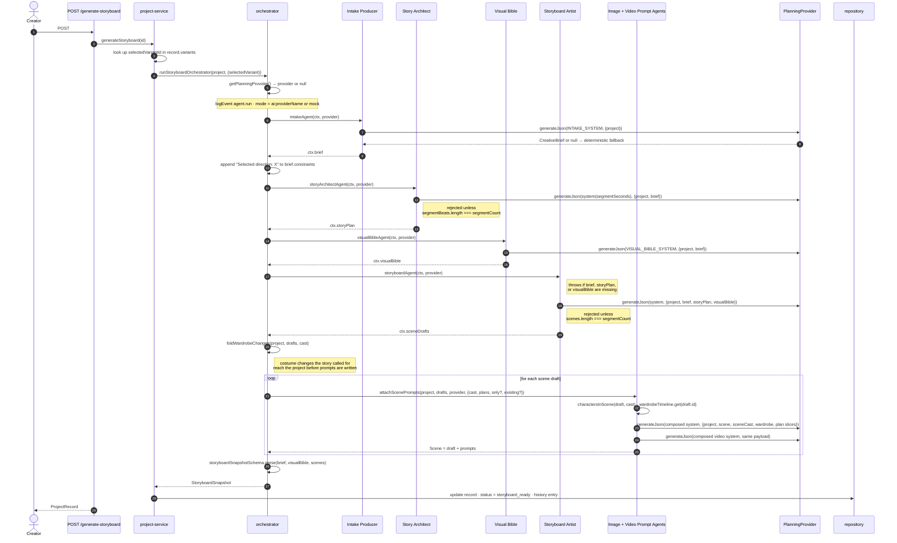

### 3.4 Agent contracts in detail

| Agent | System prompt constant | Provider result accepted when | Deterministic fallback |
|---|---|---|---|
| Intake Producer | `INTAKE_SYSTEM` | parses as `creativeBriefSchema` | `buildCreativeBrief` |
| Story Architect | `storyArchitectSystem(segmentSeconds)` | parses **and** `segmentBeats.length === segmentCount` | `buildStoryPlan` |
| Visual Bible | `VISUAL_BIBLE_SYSTEM` | parses as `visualBibleSchema` | `buildVisualBible` |
| Storyboard Artist | `storyboardSystem(segmentSeconds)` | parses **and** `scenes.length === segmentCount` | `buildSceneDrafts` |
| Image Prompt | `IMAGE_PROMPT_SYSTEM` + directives † | parses the picked subset of `scenePromptsSchema` | `buildImagePrompts` |
| Video Prompt | `videoPromptSystem(segmentSeconds)` + directives † | parses the picked subset | `buildVideoPrompts` |
| Variant Explorer | `VARIANT_EXPLORER_SYSTEM` | parses **and** `variants.length >= 3` | `buildVariants` |
| World Builder | `WORLD_BUILDER_SYSTEM` | parses as `worldBibleSchema` | `buildWorldBible` |
| Director | `DIRECTOR_SYSTEM` | parses as `directorialPlanSchema` | `buildDirectorialPlan` |
| Cinematographer | `CINEMATOGRAPHER_SYSTEM` | parses as `cinematographyPlanSchema` | `buildCinematographyPlan` |
| Art Director | `ART_DIRECTOR_SYSTEM` | parses as `artDirectionPlanSchema` | `buildArtDirectionPlan` |
| Audio Director | `AUDIO_DIRECTOR_SYSTEM` | parses **and** `sceneAudioCues.length === scenes.length` | `buildAudioPlan` |
| QC | `QC_SYSTEM` | parses as `qcResultSchema` | `evaluateQc` |

† The prompt agents no longer have a single system constant. Theirs is composed at
call time from the base prompt plus `explicitnessDirective`, `wardrobeChangeDirective`,
`imagePromptDirective`/`videoPromptDirective` (which depend on the *pinned model
family*), `seamDirective`, `castSystemDirective` and `precedenceDirective`. Two
projects therefore send materially different system prompts to the same agent.

Segment length is **interpolated into the prompt** rather than hard-coded, because
telling a model "20-second segments" for an 8-second project produces beats with
far more action than the rendered clip can hold.

### 3.5 How an agent actually executes

Every agent follows the identical shape, which is what makes the parity rule
enforceable:

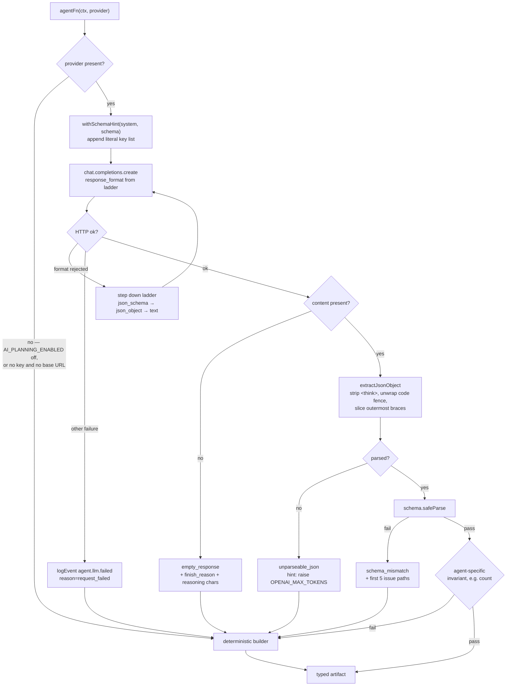

Notable design points:

- **Schema hint injection** (`agents/llm/schema-hint.ts`) renders a compact,
  lossy key list from the Zod schema and appends it to the system prompt. Agent
  prompts name schemas the model has never seen; without the hint, small local
  models return plausible JSON with the wrong keys.
- **Response-format ladder** — `json_schema` → `json_object` → `text`. The rung is
  negotiated once per process and steps down permanently when a server rejects a
  format or accepts it but returns no content. `resetResponseFormat()` restores it.
- **Every failure is logged with a reason** (`sdk_missing`, `request_failed`,
  `format_unsupported`, `empty_response`, `unparseable_json`, `schema_mismatch`)
  so a silent fallback is diagnosable rather than looking like success.
- **The SDK is a guarded dynamic import**, so a missing `openai` package degrades
  to deterministic output instead of crashing the build.

---

## 4. Media generation & the QC loop

Media generation is **discovery-first**: list models → resolve a model → fetch its
schema → override only validated fields → submit → poll. Each invocation produces
a new **attempt**, then QC runs.

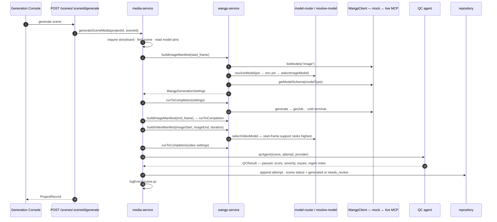

**Session serialization.** WanGP holds a single generation session, so every
submission funnels through a process-wide promise chain in `wangp-service`
(`enqueue`). A predecessor's rejection is swallowed so one bad job cannot poison
the queue, and a job that exceeds its poll budget is cancelled to release the
session. This only protects one app process — the WanGP web UI can still take it.

**Model resolution order:** per-project pin → env pin (`WANGP_VIDEO_MODEL` etc.)
→ router heuristic. The router ranks by installed availability, then start-frame
support (video), then project `modelStrategy` (`prefer_wan` / `prefer_ltx` /
`prefer_hunyuan`), then quality rank. Models that report multiple outputs — LTX-2
reports `["image","video"]` — are matched against the full output list rather than
the first entry.

### 4.1 LoRAs and trigger words

The MCP server publishes no LoRA inventory, so discovery is a filesystem read of
`WANGP_LORA_ROOT`. `lib/wangp/lora-catalog.ts` maps a model to its folder by
testing `base_model_type`, then `family`, then `model_type` against the directories
actually present — `family` is the reliable key, `base_model_type` can disagree
with it, and decoy folders exist (`ltx2_22B` is not a directory while
`old_ltx2_22B` is). Only immediate `.safetensors` / `.sft` children are listed;
`.lset` files are WanGP presets, not weights. Sidecars in `loras_metadata/<family>/`
supply display labels and `trainedWords`.

Selection lives on the project: `loras` for the whole storyboard, `sceneLoras`
keyed by scene id for overrides. An override *replaces* the storyboard selection
rather than merging with it.

```
project.loras + project.sceneLoras[sceneId]
    → resolveSceneLoras()                     [lib/lora/scene-selection.ts]
    → buildImage/VideoManifest → resolveModel()
    → reconcileLoras(selection, catalogForModel(model))   → ResolvedLora[]
    → appendTriggerWords(prompt, resolved)    → prompt sent to WanGP
    → activated_loras / loras_multipliers
```

Four properties this encodes:

1. **Reconciliation happens after model resolution, not before.** The manifest
   builders pick the model themselves and may substitute the pin (a scene with
   character references forces a reference-capable image model), so a selection
   has to be checked against the model actually used. Incompatible entries are
   dropped and logged rather than thrown, because failing scene 7 of 20 over a
   stranded LoRA is worse than rendering it without one. Saving a selection uses
   the strict path instead, where an unknown name is an actionable error.
2. **Trigger words ride along on reconciliation.** They exist only in the sidecar
   metadata, and the persisted selection stores nothing but name, strength and any
   chosen trigger words, so `reconcileLoras` returns `ResolvedLora` (selection +
   effective `triggerWords` + `availableTriggerWords`) to avoid a second catalog
   read. `appendTriggerWords` then adds only the words the prompt does not already
   contain, matched case-insensitively on word boundaries. Governed by
   `config.media.appendLoraTriggerWords`.

   Which words are *effective* is decided by `lib/lora/trigger-words.ts`, because
   trigger words are not always additive: a multi-concept LoRA uses them as a
   selector between mutually exclusive behaviours, and applying all of them asks
   for contradictory output. One offered word is used automatically; several are
   used only once the user chooses; an explicit empty choice is distinct from
   never having chosen (hence `triggerWords?: string[]` rather than a defaulted
   array). Choices are filtered against what the LoRA currently offers, so a stale
   word cannot survive the LoRA being replaced.
3. **`resolveSceneLoras` is a dependency-free module.** Both the server (during
   generation) and the browser (previewing which trigger words a scene will
   receive) apply the identical rule; two implementations would drift and the
   preview would misreport what is about to be generated.
4. **`activated_loras` is written on every job, empty list included.** WanGP's
   published defaults are its own saved UI state, so copying them verbatim — which
   a complete settings payload requires — silently inherits whichever LoRAs were
   last selected in the WanGP window. Writing the field unconditionally is what
   makes a render reproducible from the project alone. `loras_multipliers` is
   written alongside it, index-aligned, or a stale multiplier would mis-weight a
   fresh stack.

Scene prompts are hand-editable via `PATCH /scenes/:sceneId/prompts`, which writes
into the storyboard snapshot rather than beside it. That preserves the invariant
that the Prompts panel shows exactly what will be sent, at the cost of edits being
replaced when the storyboard is regenerated.

`PATCH /scenes/:sceneId/framing` edits `subjectFaceVisible` the same way, for
correcting the Storyboard Agent's read of a shot without regenerating the plan.

### 4.2 Character identity conditioning

Several mechanisms, ordered by where they act in the pipeline.

**Scoping to the scene** (`lib/agents/scene-cast.ts` → `charactersInScene`) decides
who a shot carries. A declared `scene.charactersPresent` wins; without one — every
storyboard written before the field existed — presence is read from the card by
matching names in its title, objective, beat, visual, action and dialogue. An empty
result is a real answer, not a detection failure. The description, the photograph
and the face swap are all gated on it, because each is an instruction to put that
person in the picture.

**Reference images** (`lib/services/media-service.ts` → `resolveCastReferenceImages`)
resolve up to two files per character **in that scene** into absolute paths, sent as
`image_refs` with `video_prompt_type` set to the activating letter.
`buildSettingsManifest` also sets `remove_background_images_ref` when references are
present: with the background intact the whole photo acts as the reference and the
identity signal is diluted.

A photograph conditions the whole frame rather than one figure in it, so on a shot
with several people the likeness lands on more than one. `project.useCharacterReferenceImages`
(absent = true) declines it. That also lifts the model-substitution rule in §4.1:
the constraint that the image model must accept references only binds while
`imageRefs` is non-empty, so opting out frees the pin for free.

**Withholding the written face** (`lib/agents/cast.ts`).
`castSheet(cast, forRender, wardrobeAt, options)` takes a flag distinguishing render
prompts from planning payloads, this scene's point on the wardrobe timeline, and
`SheetOptions { faceVisible, tightShot }`. `facialDescription` is dropped when the
character has a reference image **or** the shot shows no face. On a close-up with a
photograph the sheet collapses to name and wardrobe, since a head-to-toe inventory
is out of frame and pushes the model to widen until it can show it — but never
without a photograph, because then text is the only identity signal there is.

This inverts the module's original premise — that identical text is the only thing
holding a face together. That held while text was the sole identity signal. Once a
photo is supplied the two compete, and under classifier-free guidance text wins:
the base (non-distilled) Flux variant, with real CFG, produced *worse* likeness
than the distilled one precisely because it followed the written face harder.
Empirically confirmed: removing those sentences tracked the photo far more
closely. Planning agents keep the full description, having no photo.

**Stills get the sheet, clips get names** (`castContinuityClause`). A clip renders
from its start frame, which already fixes the face, wardrobe and lighting, so
repeating the sheet spends the prompt on appearance the model can see at the cost
of the motion it cannot — and a second written description of a subject already in
the image is one way a clip renders that subject twice.

**Wardrobe** (`lib/agents/wardrobe.ts` → `wardrobeTimeline`) is a timeline rather
than a constant: the effective outfit for a scene is the last change at or before
it. A `within` change splits the scene's two frames, which is the one place they are
meant to differ in clothing and lifts the identical-clothing rule for that scene
alone. The clause is appended **last**, the strongest position in the prompt, which
is why nudity had to become a state rather than an outfit — a stated garment there
overrides an explicit act. Non-cast subjects are tracked by free-text label and
delivered by `othersWardrobeSuffix`.

**Face swap** (`lib/services/face-swap-service.ts`, `lib/wangp/face-swap-preset.ts`)
is a Qwen Image Edit post-process: `image_guide` is the generated frame,
`image_refs` is the character photo, driven by a prompt/LoRA/step set carried
verbatim from a proven recipe. Applied inside `renderKeyframe`, so both full scene
generation and keyframe previews get it.

```
start frame ─▶ swapFace ─▶ end frame (references the SWAPPED start) ─▶ swapFace ─▶ clip
```

Three properties this encodes:

1. **Synchronous, not deferred.** The end frame is rendered against the start
   frame and the clip from both, so a swap landing afterwards would be overwritten
   by the frames it was meant to correct. Four Lightning steps makes the ordering
   constraint cheap.
2. **Degrades rather than propagates.** `swapFace` returns null on any failure —
   model absent, no output, request failed — and the caller keeps the original
   frame. An enhancement failing must not fail the scene.
3. **Single subject only.** `sceneFaceSwapSubject()` returns a character only when
   exactly one of those *in that scene* has opted in, because the preset's prompt
   names "the woman" in each picture. Two opted-in characters is ambiguous, and
   swapping the wrong face is worse than not swapping, so it is skipped and logged.
4. **Gated on presence and on the planned shot.** The pass never declines on its
   own: told to replace a head in a frame that has none, it invents somewhere to
   put one. Two gates therefore apply — whether the subject is in the scene at all,
   and `scene.subjectFaceVisible`, which the Storyboard Agent sets from the framing
   it planned. In the batch phase a frame shared by two scenes (`reuse_end_frame`)
   is swapped if either shows the face, and scenes the subject is absent from are
   skipped entirely. `swapAttemptFrame()` is deliberately ungated, being an
   explicit instruction rather than an inference.

`swapAttemptFrame()` is the escape hatch: it applies the swap to one stored frame
of the latest attempt, for when the plan and the render disagree. Attempts carry
`startImageSourcePath` / `endImageSourcePath` — the frames as rendered, before any
swap — and the manual pass always reads from those. Swapping is therefore
repeatable rather than cumulative, and `revertAttemptFrame()` can put the original
back. It deliberately touches nothing downstream: the frames and clips already
derived from that image keep their old content until regenerated, which is the
cost of doing it out of order.

**Scene continuity** carries the result forward: under `reuse_end_frame` a scene
starts from the previous scene's swapped end frame rather than re-synthesising —
unless the seam is a planned cut, in which case it renders its own start frame
(see [Scene continuity and the seam](#scene-continuity-and-the-seam)).

Face swap corrects keyframes only. The clip between them is model-interpolated, so
identity can drift mid-motion even when every keyframe is exact.

### Scene continuity and the seam

`project.sceneContinuity` decides what a scene inherits from its predecessor:
`cut` (render both frames), `reuse_end_frame` (start from the previous end frame),
`continue_video` (continue from the previous clip). It is now read in **two**
places, planning as well as rendering.

**Planning.** A segment boundary exists because the video model renders about
`segmentSeconds` at a time — a technical join, not a creative cut.
`lib/agents/continuity.ts` turns the mode into a directive: on the continuing
modes the Cinematographer holds shot size, lens and camera height across
boundaries and varies movement instead, while the Storyboard and Image Prompt
agents are told each segment's start frame *is* the previous segment's end frame.
On `cut` the Cinematographer gets the opposite instruction — vary shot sizes for
contrast. `attachScenePrompts` threads the previous scene's `endFramePrompt` into
each call, because an agent cannot match a frame it has not been shown.

**Rendering.** `lib/media/seam.ts` is the backstop. `seamBreak(previous, scene)`
reads the shot size out of each prompt — the agents open with it, and only the
first 160 characters are scanned so the appended cast sheet cannot produce a
false match — and reports a cut when the size changes, falling back to
`transitionIn` naming a cut, dissolve, fade or wipe. Both `resolveContinuity()`
and the phased batch consult it and log `scene.continuity` with the reason.

Inheritance is not free of consequence: the inheriting scene's `startFramePrompt`
is never rendered. The attempt therefore records `startImageInherited` and the
scene card says so, because the Prompts panel would otherwise display text that
had no effect on any image.

### Scene status lifecycle

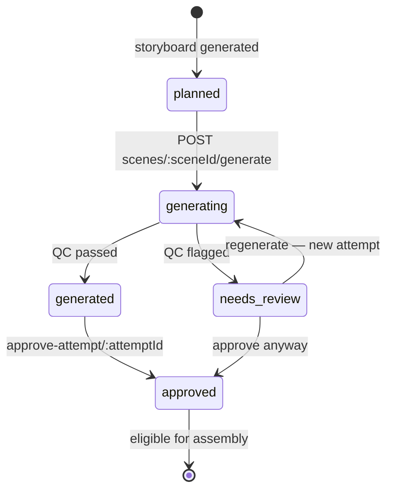

### WanGP job lifecycle

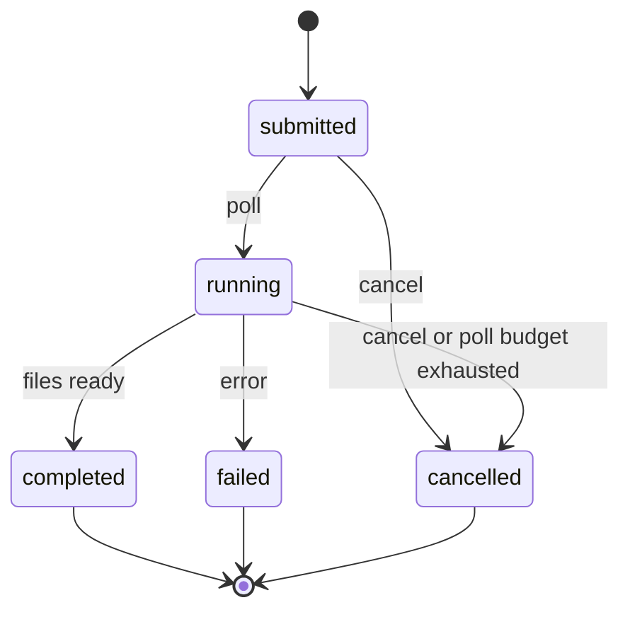

---

## 5. Audio path

Dialogue and narration are **performed by the video model** from the scene prompt —
the mock video-prompt builder quotes spoken lines inline in prose, matching the
format WanGP's LTX-2 defaults expect, and appends a lip-sync instruction. Nothing
in StoryForge synthesizes speech.

The Audio Director therefore plans only the beds that are generated separately:

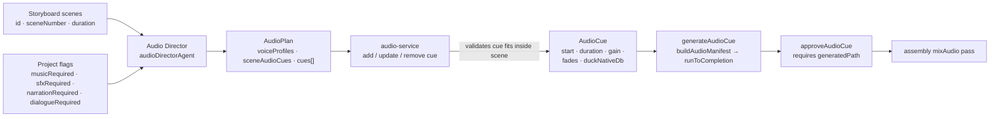

Cue defaults encode intent: **music** sits under the clip at `-8 dB` with long
fades and ducks the native track `-12 dB`; **SFX** sits on top at `-3 dB` with
near-instant fades and no ducking. Editing a cue's *timing* preserves rendered
audio; editing its *prompt* clears `generatedPath` and un-approves it.

---

## 6. Assembly & export

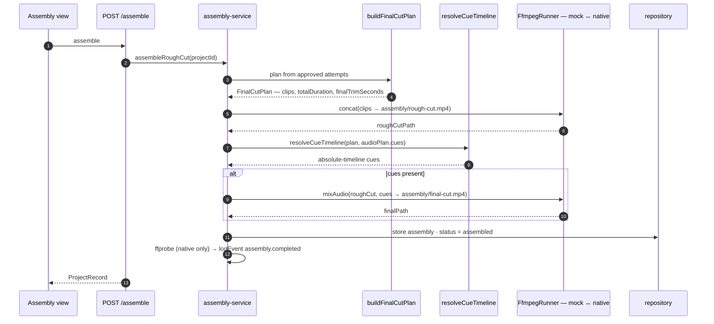

The mix is a **second pass with the video stream copied**, so iterating on audio
never re-encodes picture, and the rough cut survives as the un-scored reference.
Per-scene trim is applied during the concat — the final scene's duration already
absorbs `trimAtEndSeconds`, so `finalTrimSeconds` is a record of discarded
material and must not be subtracted twice.

Export package via `GET /api/projects/{id}/export?format=…`:
`json` · `md` · `manifest` · `animatic` · `final-cut`.

---

## 7. Data model

`ProjectRecord` is the per-project aggregate. Each agent owns exactly one slot on
it, which is what makes agents independently re-runnable.

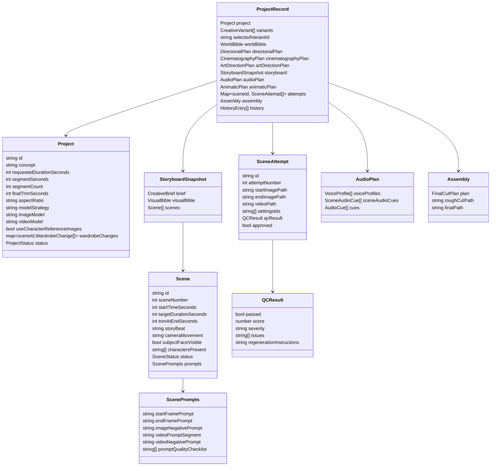

`SceneDraft` is `Scene` minus `prompts` — the type system encodes the hand-off from
the Storyboard Artist to the prompt agents. The draft also carries the
`wardrobeChanges` the Storyboard Artist declared, which `foldWardrobeChanges` lifts
onto the project before any prompt is written; they live on the project rather than
the scene because a change carries forward to every scene after it.

### 7.1 Where data actually lives

**No database is in use today.** Storage is split in two:

| What | Where | Durability |
|---|---|---|
| `ProjectRecord` — project, variants, all agent plans, storyboard, audio plan, attempts, assembly metadata, history | **In-process JavaScript `Map`**, pinned to `globalThis.__storyforgeStore` | Lost on process restart |
| Rendered media — images, video segments, `rough-cut.mp4`, `final-cut.mp4` | **Local filesystem** under `config.dataDir` (`./projects/{projectId}/…`) | Survives restart, but is orphaned once the in-memory record is gone |

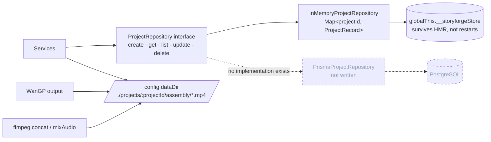

What exists versus what is wired:

- **The interface is real.** `lib/db/repository.ts` defines `ProjectRepository`,
  and every service talks only to it — no service imports a store implementation
  directly. Swapping in a durable store requires no application-logic changes.
- **Only one implementation exists.** `InMemoryProjectRepository` wraps a `Map`,
  sorting `list()` by `createdAt` descending. It is held on `globalThis` so the
  store survives Next.js hot-module reloads in dev and is shared across route
  handlers in the same process.
- **`config.persistence` is read but not acted on.** `lib/config.ts` parses
  `STORYFORGE_PERSISTENCE` into a `"memory" | "prisma"` value, but
  `lib/db/store.ts` constructs `InMemoryProjectRepository` unconditionally. There
  is no `PrismaProjectRepository`, and nothing in `lib/` imports
  `@prisma/client`.
- **`prisma/schema.prisma` is a scaffold only.** It declares a `postgresql`
  datasource and a single `Project` model that stores the whole storyboard
  snapshot as a `Json?` column, with enum-like fields modelled as `String`
  (constrained by the union types in `lib/types.ts`) rather than native DB enums,
  for portability. It is not generated, migrated, or queried by the app.
- **`docker-compose.yml` ships a Postgres service** so the durable path can be
  developed against, but the running app never connects to it.

Practical consequences: a project vanishes on server restart; two app instances do
not share state; and there is no transactional boundary — each service builds a
new `ProjectRecord` immutably and calls `repository.update(id, record)` as a
whole-object replace, which is last-write-wins under concurrency.

### Project status lifecycle

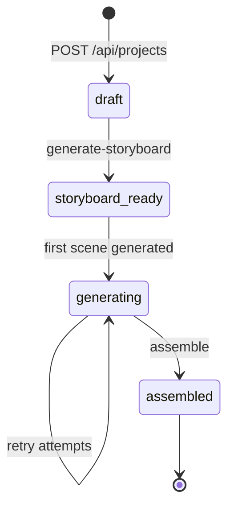

Every state change also appends a `HistoryEntry` (`variants.generated`,
`variant.selected`, `world_bible.generated`, `storyboard.generated`,
`audio_cue.added`, `scene.generated`, `assembly.completed`, …). The Agentic Canvas
renders this as the project's decision log.

---

## 8. API surface

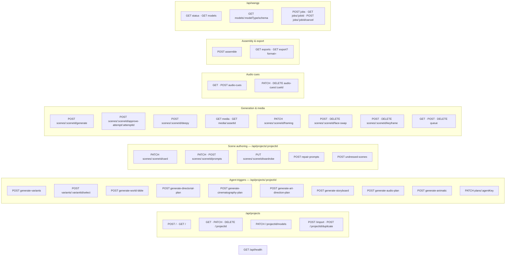

---

## 9. Configuration, flags & the mock strategy

`lib/config.ts` reads `process.env` once and exposes a typed, frozen object.
Everything defaults off/local.

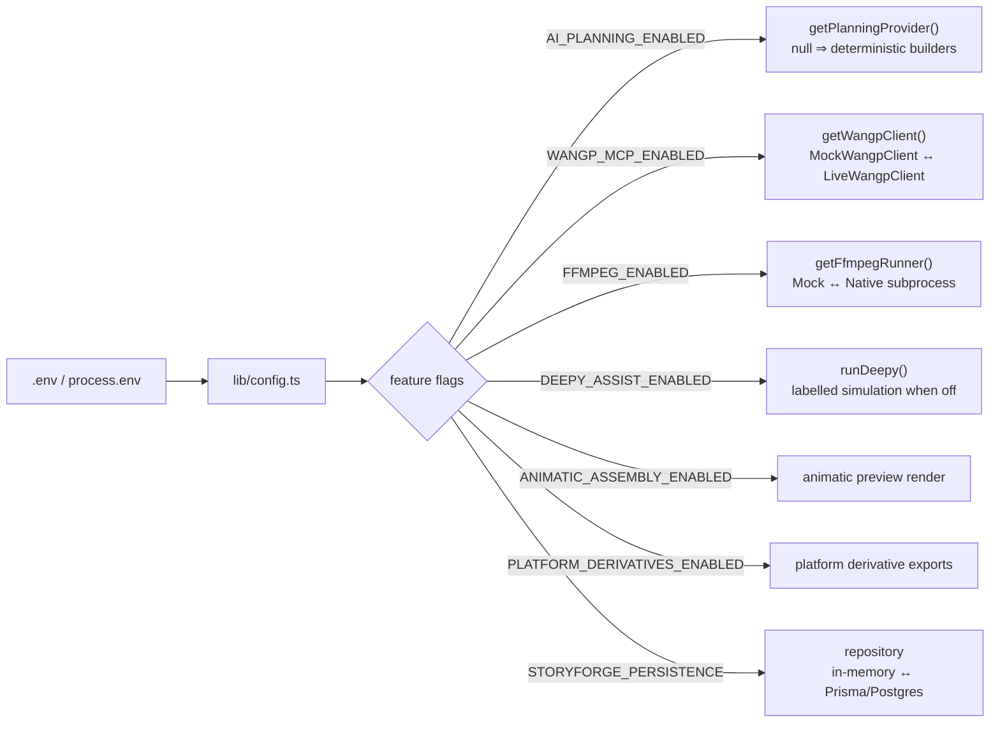

| Interface | Default (mock) | Live path |
|---|---|---|
| `PlanningProvider` | deterministic builders | OpenAI-compatible chat completions |
| `WangpClient` | `MockWangpClient` — completes in two polls | `LiveWangpClient` over MCP at `WANGP_MCP_URL` |
| `FfmpegRunner` | `MockFfmpegRunner` | native `ffmpeg` / `ffprobe` subprocess |
| `ProjectRepository` | `InMemoryProjectRepository` on a global `Map` | **not implemented** — Prisma/Postgres is scaffolded only, see [§7.1](#71-where-data-actually-lives) |
| Deepy | simulated, clearly labelled | live Deepy sidecar |

The repository and WanGP client are both pinned to `globalThis` so they survive
Next.js hot-module reloads and are shared across route handlers. Note that
`STORYFORGE_PERSISTENCE` is currently parsed but inert — the in-memory store is
always selected.

---

## 10. Cross-cutting concerns

- **Validation** — Zod at every trust boundary: request bodies, external payloads,
  and *agent output*. The orchestrator re-parses the assembled snapshot before it
  is ever persisted, so a malformed artifact cannot reach the store.
- **Telemetry** — structured single-line JSON with a closed event taxonomy:
  `project.created`, `project.updated`, `storyboard.generated`, `agent.run`,
  `agent.llm.failed`, `wangp.discovery`, `wangp.model.selected`,
  `wangp.job.submitted`, `wangp.job.polled`, `scene.qc`, `audio_cue.generated`,
  `assembly.completed`, `health.check`. Fire-and-forget; never throws into a
  request path.
- **Error taxonomy** — `NotFoundError` / `ValidationError` in `lib/errors.ts` map
  to 404 / 400; handlers return `{ error, details }`.
- **Media path safety** — `lib/media/path-policy.ts` and `refs.ts` gate which
  files may be served through `/api/projects/{id}/media/{assetId}`, so generated
  output is never exposed by raw filesystem path.
- **Health** — `GET /api/health` backs the container healthcheck.

---

## 11. Testing architecture

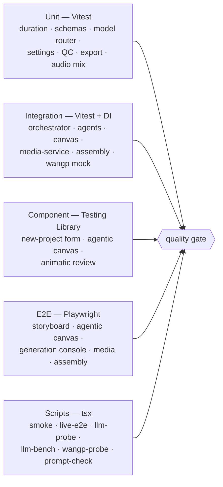

Because every agent takes its provider as an argument and the orchestrator accepts
`OrchestratorDeps`, the entire agent pipeline is testable by injecting a fake
`PlanningProvider` — or `null` to assert deterministic parity. No test needs cloud
credentials or a running WanGP server.

---

## 12. Deployment

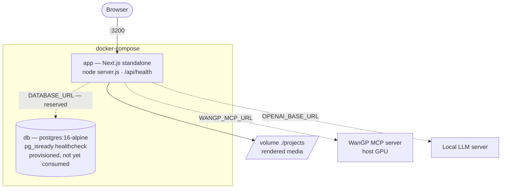

Multi-stage `Dockerfile` (`deps` → `builder` → `runner`) produces a self-contained
Next.js standalone image running as a non-root user. It runs in in-memory demo
mode: the bundled Postgres service is provisioned for the future durable store but
is not yet used, so project state does not survive a container restart. Rendered
media under `./projects` is the only persistent output and should be
volume-mounted.
