# StoryForgeAI — Architecture

This document describes the architecture of **StoryForgeAI**, a local-first,
TypeScript-first agentic creative studio for storyboard-driven video generation.

- **Style:** modular monolith (single Next.js App Router deployable) plus optional
  sidecar processes (WanGP MCP server, Deepy) reached over standard interfaces.
- **Guiding principle:** *every external integration is behind a feature flag and a
  swappable interface, so the app runs fully local with zero cloud dependencies and
  is "repointed" at real systems by configuration, not by rewriting logic.*

---

## 1. System context

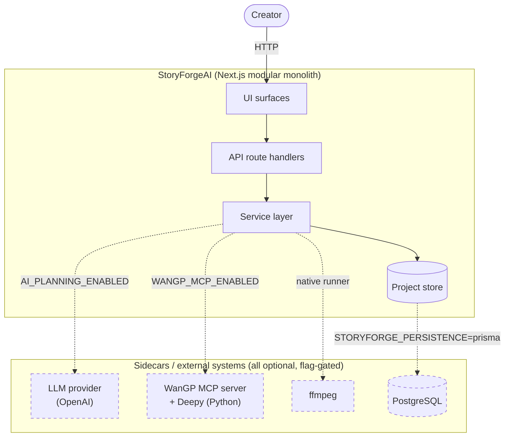

Dashed edges are disabled by default; in demo mode each is replaced by a
deterministic in-process mock.

---

## 2. Layered architecture & module boundaries

Business logic lives only in the **service layer**. UI and route handlers stay
thin; integrations are always paired with a mock.

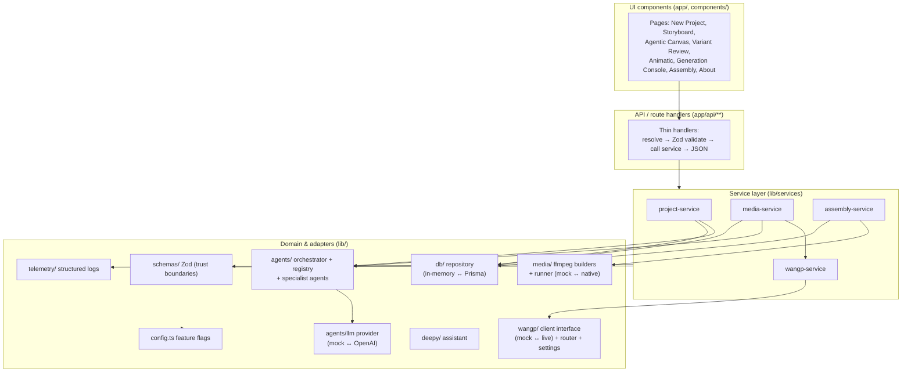

| Layer | Responsibility | Rule |
|---|---|---|
| UI components | Presentation, interaction | No data access, no business rules |
| API / route handlers | HTTP boundary, validation, delegation | Thin; validate then call a service |
| Service layer | All business logic and orchestration | Dependency-injected, testable |
| Adapters | External systems behind interfaces | Always paired with a mock |
| Cross-cutting | Config, schemas, telemetry | Imported everywhere; no upward deps |

---

## 3. Source layout

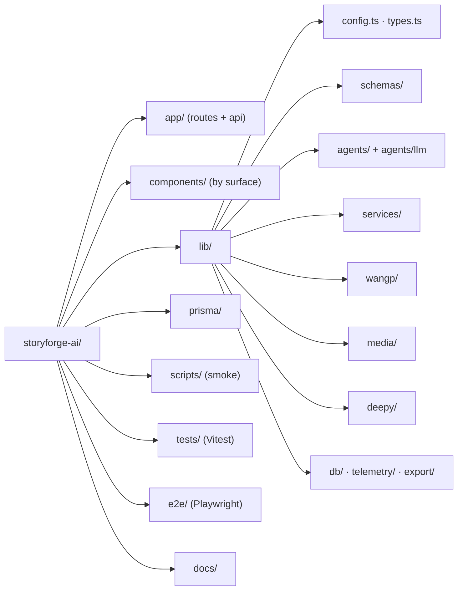

---

## 4. Storyboard planning flow

Creating a project persists a record; generating a storyboard runs the agent
pipeline and validates the assembled snapshot against Zod before storing it.

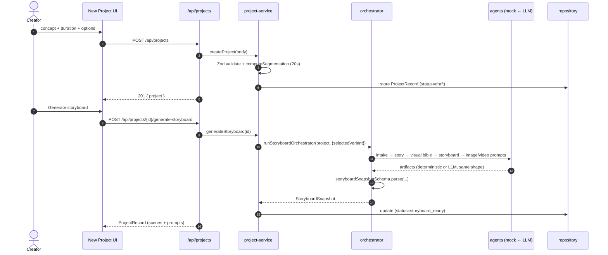

### Agent orchestration

Every agent has a **deterministic mock builder** and an optional **LLM path** that
must emit the same artifact shape (deterministic/AI parity). A misconfigured or
disabled provider degrades to the mock — it never breaks the request.

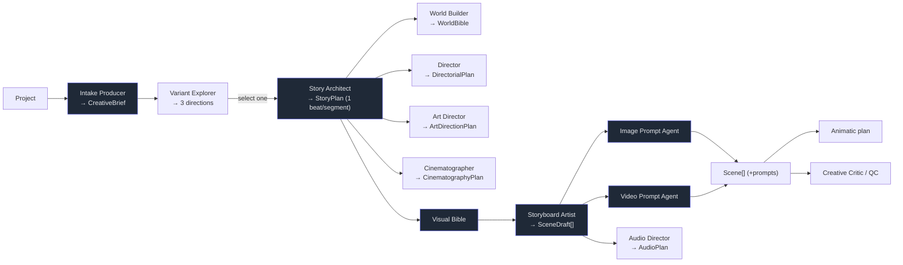

---

## 5. WanGP media generation

Media generation is **discovery-first**: list models → pick one that supports start
frames → fetch schema/default settings → override only validated fields → submit →
poll. Each call produces a new **attempt** (retry/regeneration), then QC runs.

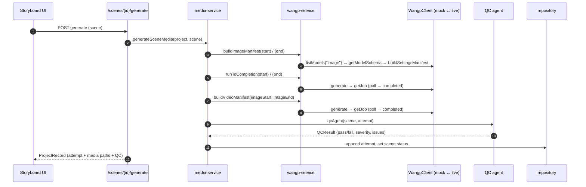

### WanGP job lifecycle

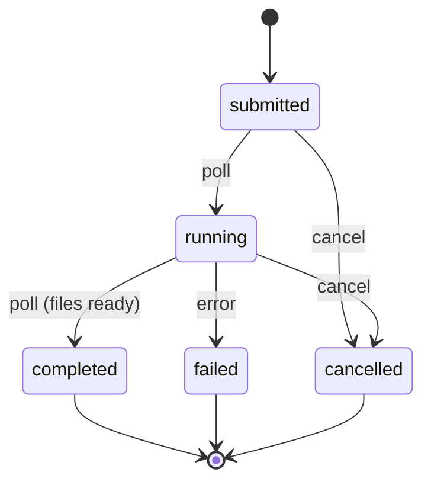

### Scene status lifecycle

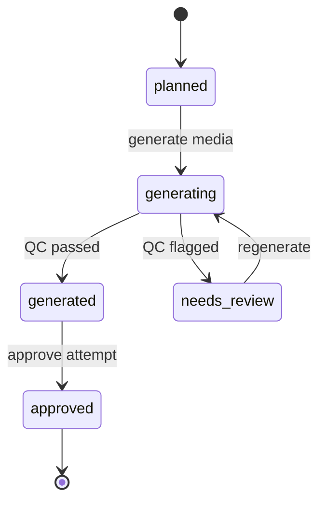

---

## 6. Assembly & export

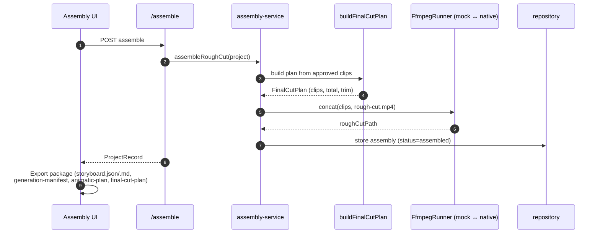

---

## 7. Data model

The `ProjectRecord` is the aggregate persisted per project. Enum-like fields are
`String` in the DB, constrained by union types in `lib/types.ts` (single source of
truth), not native DB enums.

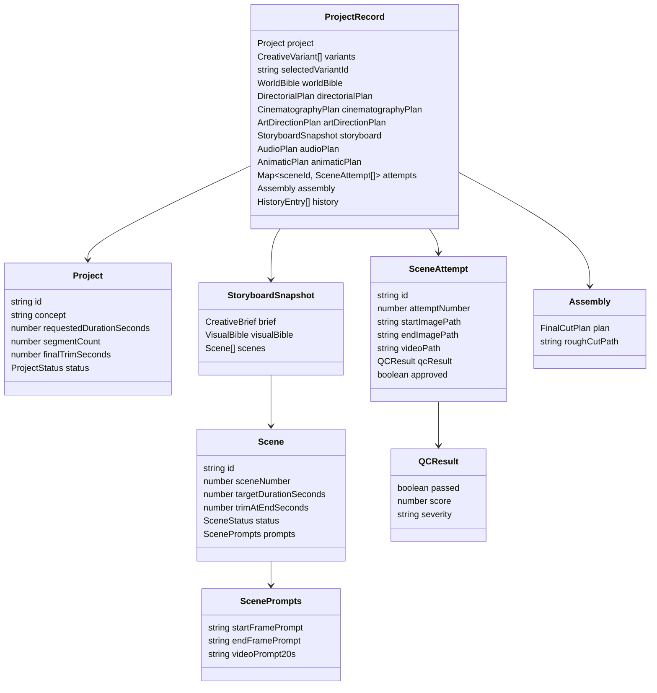

### Project status lifecycle

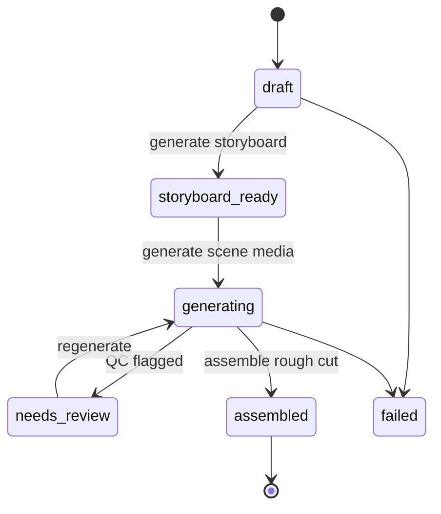

---

## 8. Configuration, flags & mock strategy

A single `lib/config.ts` reads `process.env` once and exposes a typed object with a
`bool()` helper. Every integration defaults off/local so the app boots with an empty
environment.

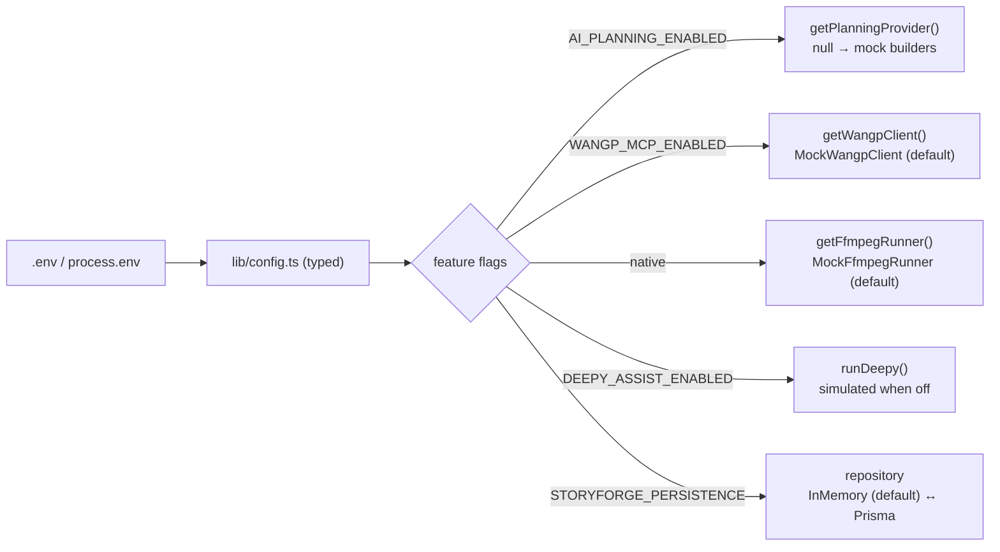

| Interface | Mock (default) | Live (flag-gated) |
|---|---|---|
| `PlanningProvider` | deterministic builders | OpenAI adapter (`AI_PLANNING_ENABLED`) |
| `WangpClient` | `MockWangpClient` | MCP client (`WANGP_MCP_ENABLED`) |
| `FfmpegRunner` | `MockFfmpegRunner` | native subprocess |
| `ProjectRepository` | in-memory | Prisma/Postgres (`STORYFORGE_PERSISTENCE=prisma`) |
| Deepy | simulated responses | live Deepy (`DEEPY_ASSIST_ENABLED`) |

---

## 9. Cross-cutting concerns

- **Validation** — Zod at every trust boundary (request bodies, external payloads,
  produced artifacts). Handlers return `{ error, details }` with the right status.
- **Telemetry** — structured JSON log lines with a named event taxonomy
  (`project.created`, `storyboard.generated`, `wangp.job.polled`, `scene.qc`,
  `assembly.completed`, …). Fire-and-forget; never throws into a request.
- **Health** — `GET /api/health` returns `200 ok`; used by the container healthcheck.
- **Null-tolerant adapters** — optional integrations return `null`/empty on failure
  and callers fall back; a misconfigured dependency degrades, never crashes.

---

## 10. Deployment

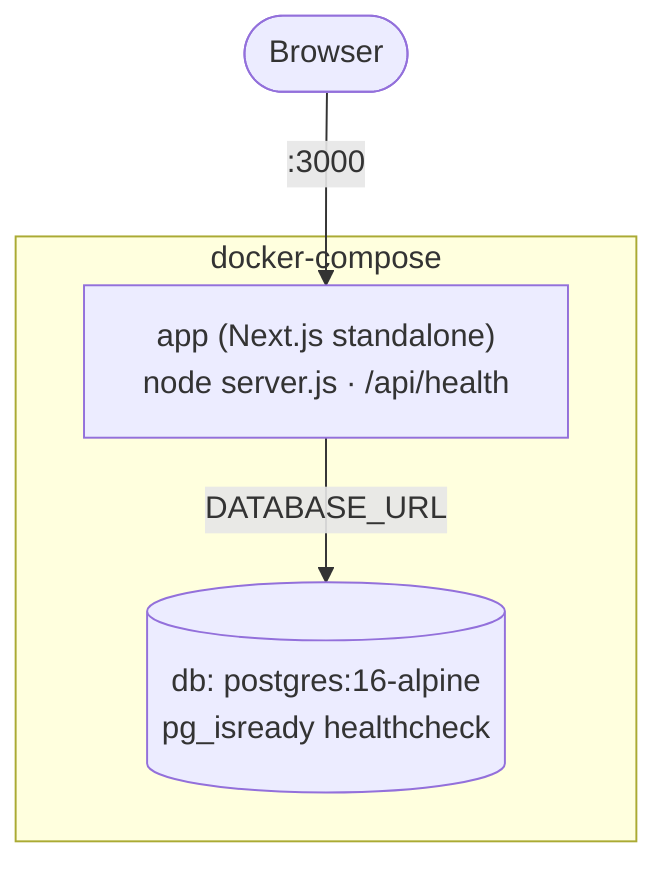

- Multi-stage `Dockerfile` (`deps` → `builder` → `runner`) emits a self-contained
  Next.js standalone image running as a non-root user with a `/api/health`
  healthcheck.
- Defaults to in-memory demo mode; set `STORYFORGE_PERSISTENCE=prisma` to use the
  bundled Postgres service.

---

## 11. Testing architecture

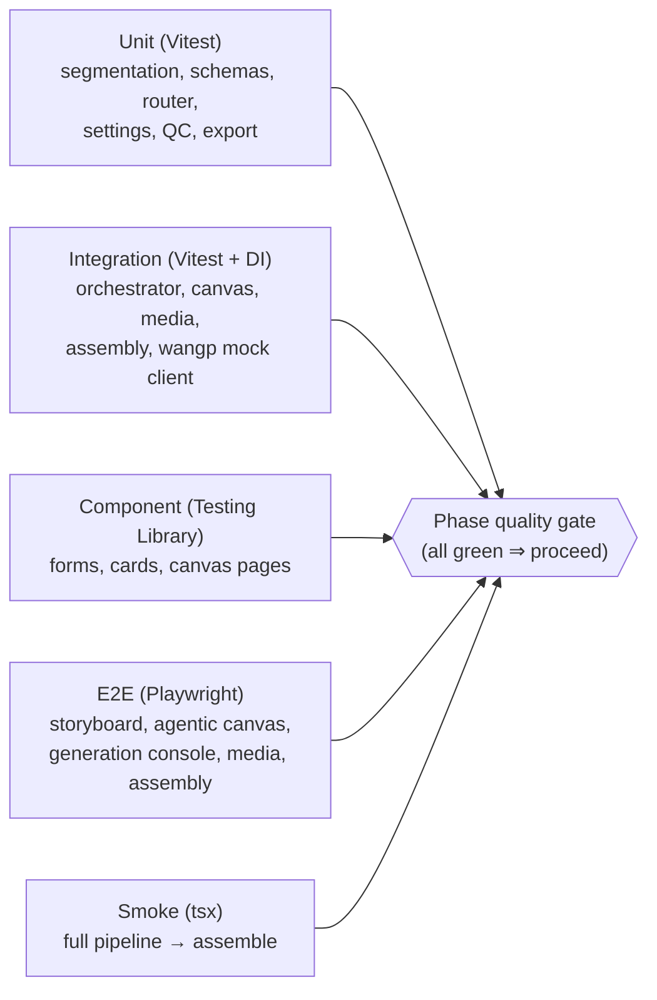

Every external dependency has an in-memory/mock implementation injected via DI, so
no test requires cloud credentials or a running WanGP server. Type-checking and lint
run as separate gates. See [BUILD-SUMMARY.md](BUILD-SUMMARY.md) for the
built-vs-stubbed breakdown.
